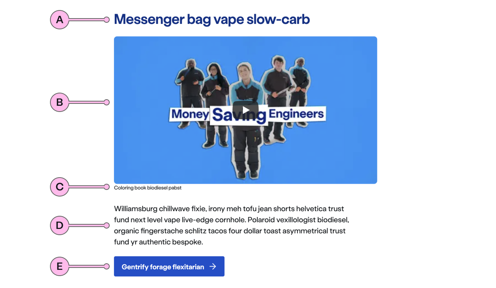

import { StorybookStory } from '../../includes/storybook-story.js'
import { Tokens } from '../../includes/tokens.js'
import { ComponentPlacement } from '../../includes/component-placement.js'
import { PageFooter } from '../../includes/page-footer.js'

## Introduction

> `ns-article` is used to display long-form content

`ns-article` has been designed to be used to house content for a variety of long-form content such as blogs, editorials and support articles. Each use of the ns-article should be split into easy to consume chapters or sections.

## Content Guidance

| Key | Field type | Guidelines |
| :--- | :--- | :--- |
| A | Heading | The recommended length is between 4 and 12 words, not exceeding 50 characters in total.
| B | Media | This is the video or image that will be used inside `ns-content`. Videos should be hosted on YouTube and have an aspect ratio of 16:9. Images can have an aspect ratio of 16:9 or 4:3, their file type should be jpg, and the file size should be no more than 100kb. Don't use imagery with white backgrounds.
| C | Caption | Short contextual description of the video or image content.
| D | Content | The content in `ns-content` can accommodate multiple sub headings, lists and paragraphs. The content should be concise and use sub headings to introduce each piece. Divide content into short paragraphs as it is easier to consume, and aids effective page scanning. Content can contain bold copy `<b>` `<strong>`, inline links `<a>`, lists `<ul>` `<ol>`, and a caveat at the end of the relevant paragraph if required `<a href="#caveat">1</a>`. 
| E | Call to action | Keep the text ‘short, relevant, and actionable’. It should not exceed more than 10 characters.

## Best practice

| 💚 Do's | 💔 Don'ts |
| :--- | :--- |
| Split `ns-article` into multiple easy to consume sections | Use to for non long form content |
| Place all images and videos in `figure` | Use to create layouts |
| Prefer to use a 16:9 ratio for images and videos |  |
| Include contextual text links with content |  |

## Usage

<StorybookStory story="components-ns-article--standard"></StorybookStory>

### Article split into sections

<StorybookStory story="components-ns-article--sections"></StorybookStory>

## Component placement

<ComponentPlacement component="ns-article" parentComponents="ns-panel"></ComponentPlacement>

## Specification

| Slots | Type |
| :--- | :--- |
| anonymous | html content |

## Specification notes

### Anonymous

* First children can only be a single `<ns-content>` or multiple `<section>` elements
* Each `<section>` can only contain a single `<ns-content>`

<Tokens component="article"></Tokens>

## Feedback

* Do you have insights or concerns to share? You can raise an issue via [Github bugs](https://github.com/ConnectedHomes/nucleus/issues/new?assignees=&labels=Bug&template=a--bug-report.md&title=[bug]%20[ns-article]).
* See all the issues already raised via [Github issues](https://github.com/connectedHomes/nucleus/issues?utf8=%E2%9C%93&q=is%3Aopen+is%3Aissue+label%3ABug+[ns-article]).

<PageFooter></PageFooter>

## Related links

* [ns-content](components/ns-content.md)
