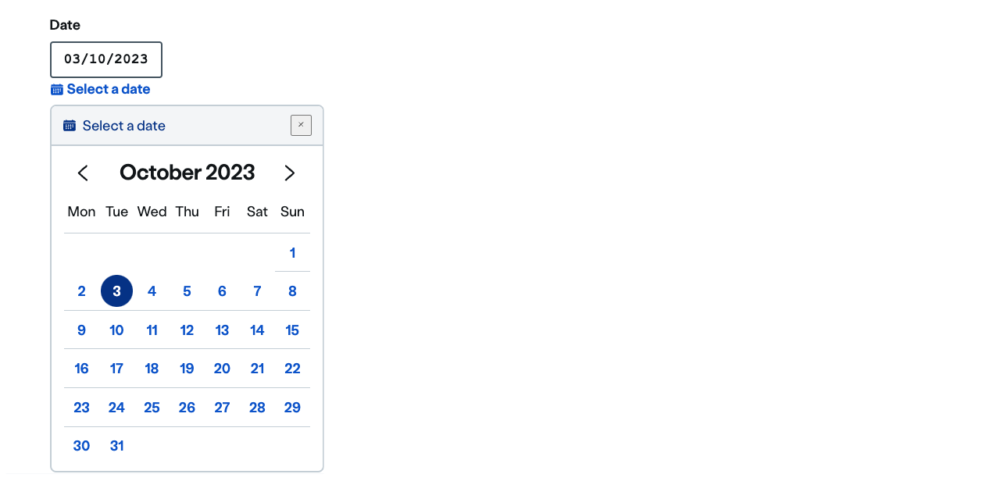

import { StorybookStory } from '../../includes/storybook-story.js'
import { Tokens } from '../../includes/tokens.js'
import { ComponentPlacement } from '../../includes/component-placement.js'
import { PageFooter } from '../../includes/page-footer.js'

## Introduction

> Use to help the user enter a date in a form.

This component wraps our ns-inputter component. Guidelines defined on the ns-inputter should also be followed when using this component.
[ns-inputter documentation](components/ns-inputter.md)

### Datepicker Types

ns-datepicker supports 2 types `default` and `mask`.
When type is set to `default` the date-picker will display a calendar UI for selecting the date.  On mobile/touch devices this will use the browsers native calendar.  On desktop/non-touch devices it will use the Nucleus calendar component.

## Best practice

Also see ns-inputter [best practices](ns-inputter.md#considerations-of-best-practices)

| 💚 Do's | 💔 Don'ts |
| :--- | :--- |
| Use the default type for picking a date from a range | Change the date format |
| Use the default type for picking a date that the user might not be sure of (e.g. Next Friday) |  |
| Use the mask type for picking a dates that are well know to the user (e.g. Date of birth) |  |

### Considerations of best practices

When the browser supports the `<input type="date">` the format of the input will change depending on the settings of their device. For example users in UK will get the dd/mm/yyyy date format where as users in United States of America will get the m/d/yy date format. Regardless of the input format dates are always returned following the ISO 8601 date format

### ISO 8601 date format

This component uses the ISO 8601 date format: YYYY-MM-DD. This allows us to build upon the native `<input type="date">` which also uses the same standard and provides a consistent approach to handling dates throughout nucleus.

## Browser support

Some browsers do not support `type='date'` (e.g. Safari on Desktop). The component detects if the browser supports this input and will fallback to use the mask type instead.

## Usage

<StorybookStory story="form-components-ns-datepicker--standard"></StorybookStory>

## Component placement

<ComponentPlacement component="ns-datepicker" parentComponents="ns-form,ns-fieldset"></ComponentPlacement>

## Specification

Also see ns-inputter [specification](components/ns-inputter.md#specification)

| Attribute      | Type      | Default   | Options | Description |
|----------------|-----------|-----------|---------|-----------|
| `autocomplete` | `string`  | "off"     |         | Value to pass to the input autocomplete attribute.
| `helper`       | `string`  |           |         | See [ns-inputter](components/ns-inputter.md#specification). |
| `label`        | `string`  |           |         | The text to place in the label. |
| `max`          | `string`  |           |         | The maximum date allowed to be entered into the input. Must be in YYYY-MM-DD format. Validation will trigger if date is entered after this value |
| `min`          | `string`  |           |         | The minimum date allowed to be entered into the input. Must be in YYYY-MM-DD format. Validation will trigger if date is before after this value |
| `name`         | `string`  | "date"    |         | See [ns-inputter](components/ns-inputter.md#specification). |
| `type`         | `string`  | "default" | `default`, `mask` | Use to select the input format. Default is the native date input. |
| `validation`   | `array`   |           |         | See [ns-inputter](components/ns-inputter.md#specification). minDate and Max date are automatically applied if the min and max values are populated. |
| `value`        | `string`  |           |         | The value the input inside the component. This can be used to add an initial value. |

| Slots | Type |
| :--- | :--- |
| `tip-details` | `div` |

<Tokens component="datepicker"></Tokens>

## Feedback

* Do you have insights or concerns to share? You can raise an issue via [Github bugs](https://github.com/ConnectedHomes/nucleus/issues/new?assignees=&labels=Bug&template=a--bug-report.md&title=[bug]%20[ns-form]).
* See all the issues already raised via [Github issues](https://github.com/connectedHomes/nucleus/issues?utf8=%E2%9C%93&q=is%3Aopen+is%3Aissue+label%3ABug+[ns-form]).

<PageFooter></PageFooter>

## Related links

* [ns-inputter](components/ns-inputter.md)
* [ns-form](components/ns-fieldset.md)
