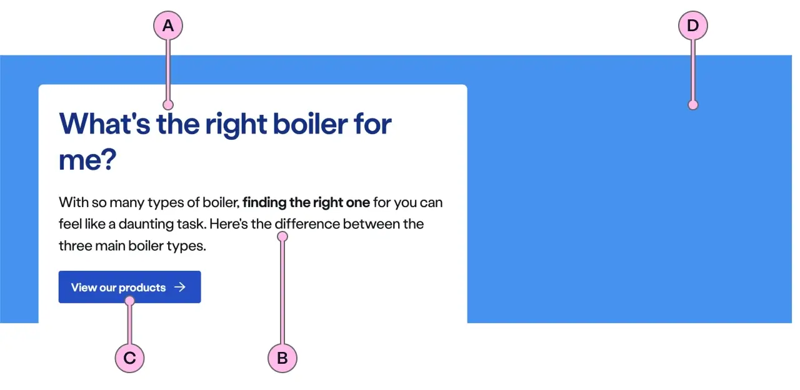
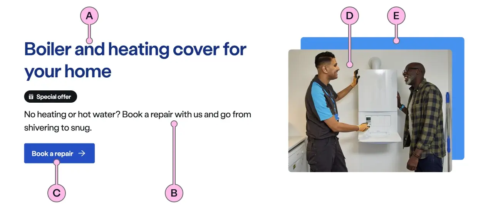
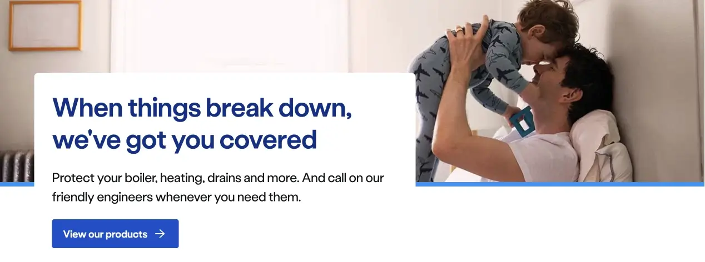
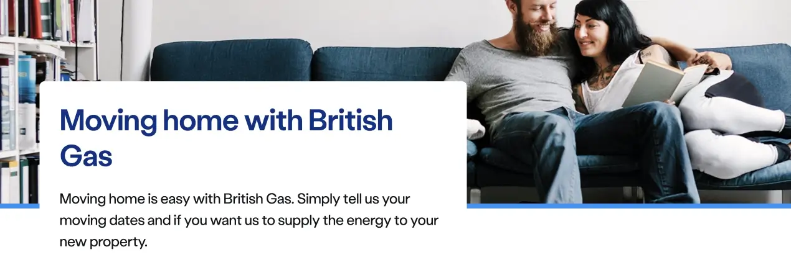
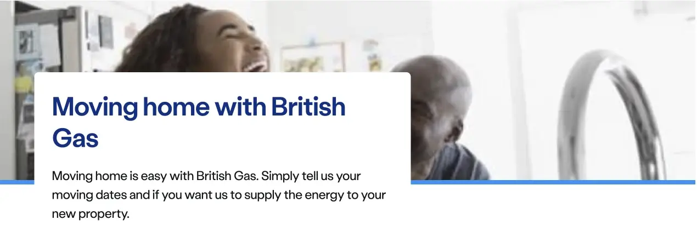
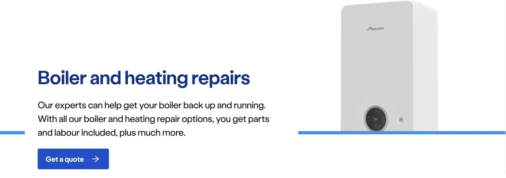
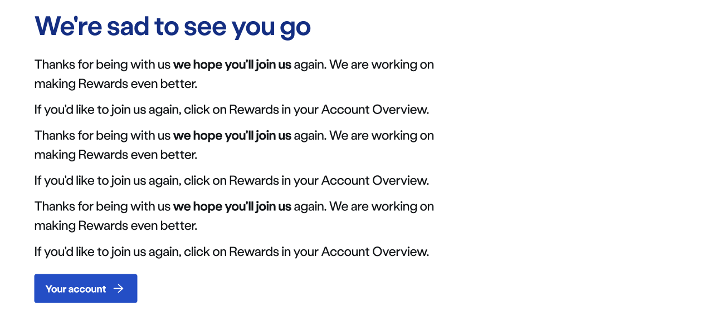
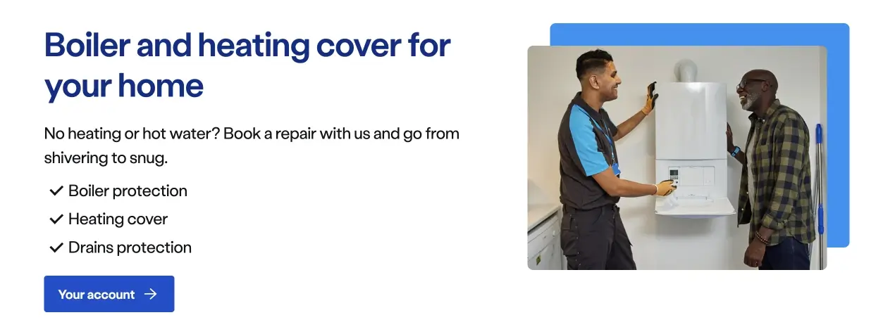
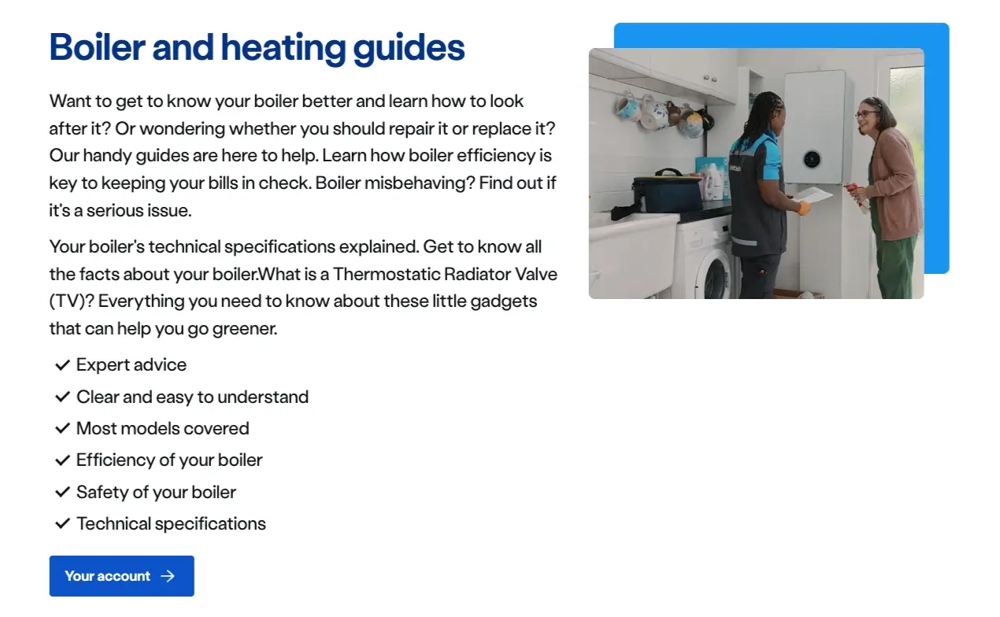

import { StorybookStory } from '../../includes/storybook-story.js'
import { Tokens } from '../../includes/tokens.js'
import { ComponentPlacement } from '../../includes/component-placement.js'
import { PageFooter } from '../../includes/page-footer.js'

## Introduction

> Landmarks are used to introduce the page, informing users of their current location and its primary purpose.

Landmarks are used to set the scene for what the page is for, what offers might be available and give helpful best next actions for users. This is where the main heading for the page will sit and give the overarching context to the rest of the page.

## Content guidance

### Summit Landmark

| Key | Field type | Guidelines |
| :--- | :--- | :--- |
| A | Sub heading | Sub headings are used to indicate the primary section or to reinforce a brand message. Short and simple words tend to work better and it is recommended to keep the length between 1 and 5 words. Include a full stop at the end of the sub-heading.  |
| B | Main Heading | The recommended length is between 4 and 12 words, not exceeding 50 characters in total. Headings contain light and bold font weight to highlight key messaging. |
| C | Content | A single, short paragraph works best. Can contain bold copy `<b>`, inline links `<a>` and a caveat at the end of the relevant paragraph if required `<a href="#caveat">1</a>`. |
| D | Action | See action guidance below |
| E | Image path | This is the image that will be used inside `ns-landmark`. Ensure the important focus area of your image remains within the safe-area. It should have an aspect ratio of 16:9, the dimensions should be 1440x810 px, the file type should be jpg, and the file size should be no more than 150kb. Please make sure you work with a designer when selecting this image as finding the right one with the correct focus area can be challenging. **Note:** The image shouldn't hold any meaning and be only used as a decoration. This is why it doesn't have an `alt=""` attribute to avoid adding unnecessary content for users using assistive technology. |

### Hillside Landmark

| Key | Field type | Guidelines |
| :--- | :--- | :--- |
| A | Sub heading | Sub headings are used to indicate the primary section or to reinforce a brand message. Short and simple words tend to work better and it is recommended to keep the length between 1 and 5 words. Include a full stop at the end of the sub-heading. **Note:** For guide pages (non-product pages produced with strong SEO focus) a Sub heading is not required. |
| B | Main Heading | The recommended length is between 4 and 12 words, not exceeding 50 characters in total. Headings contain light and bold font weight to highlight key messaging. |
| C | Content | A single, short paragraph works best. Can contain bold copy `<b>`, inline links `<a>` and a caveat at the end of the relevant paragraph if required `<a href="#caveat">1</a>`. |
| D | Decoration | Apply a colourful gradient decoration to the landmark. [The specification table](#specification) has a list of options. |
| E | Action | See action guidance below |

### Valley Landmark

> NOTE: The purpose of the valley landmark is to present an overview of a product or service as a user moves down the funnel of their purchase journey. A CTA may be used, but is not recommended in scenarios where the objective is to encourage further on-page browsing.

| Key | Field type | Guidelines |
| :--- | :--- | :--- |
| A | Sub heading | Sub headings are used to indicate the primary section or to reinforce a brand message. Short and simple words tend to work better and it is recommended to keep the length between 1 and 5 words. Include a full stop at the end of the sub-heading.  |
| B | Main Heading | The recommended length is between 4 and 12 words, not exceeding 50 characters in total. Headings contain light and bold font weight to highlight key messaging. |
| C | Content | Valley can accommodate multiple paragraph slots. However, be mindful of keeping it concise. To introduce a product or service we recommend 1 shot paragraph and three or four bullet point in a ticked list to showcase your key product benefits. It can contain bold copy `<b>`, inline links `<a>` and a caveat at the end of the relevant paragraph if required `<a href="#caveat">1</a>`. |
| D | Action | See action guidance below |
| E | Image path | This is the image that will be used inside `ns-landmark`.  It should have an aspect ratio of 4:3 or 16:9, the file type should be jpg, and the file size should be no more than 100kb. To see which image you can use - please see the Image Guidance section below. Don't use imagery with white backgrounds. Please make sure you work with a designer when selecting any imagery for the ns-landmark. **Note:** The image shouldn't hold any meaning and be only used as a decoration. This is why it doesn't have an `alt=""` attribute to avoid adding unnecessary content for users using assistive technology. |

### Lakeside Landmark

| Key | Field type | Guidelines |
| :--- | :--- | :--- |
| A | Sub heading | Sub headings are used to indicate the primary section or to reinforce a brand message. Short and simple words tend to work better and it is recommended to keep the length between 1 and 5 words. Include a full stop at the end of the sub-heading.  |
| B | Main Heading | The recommended length is between 4 and 12 words, not exceeding 50 characters in total. Headings contain light and bold font weight to highlight key messaging. |
| C | Content | Lakeside can accommodate multiple paragraph slots. However, be mindful of keeping it concise. Our guidance is a minimum of 1 and a maximum of 3. Can contain bold copy `<b>`, inline links `<a>` and a caveat at the end of the relevant paragraph if required `<a href="#caveat">1</a>`. |
| D | Action | See action guidance below |

### Image guidance

| Component | Variant | Ratio | Dimensions | Size | Type | Placeholder |
| :--- | :--- | :--- | :--- | :--- | :--- | :--- |
| `ns-landmark`| `summit` | 16:9 | 1440x810px | &lt; 200kb | jpeg | [ns-landmark-summit-1440x810px](https://user-images.githubusercontent.com/50207859/67642478-12140c80-f904-11e9-849d-5ffe39818c5b.jpg) |
| `ns-landmark`| `valley` | 4:3 | 720x540px | &lt; 100kb | jpeg | [ns-landmark-valley-720x540px](https://user-images.githubusercontent.com/50207859/67642153-d461b480-f900-11e9-9520-11204c64a11b.jpg) |

### Action guidance

#### CTA

* A CTA is optional and not recommended in scenarios where you want to encourage your user to explore content further down the page.
* If you need to include a CTA keep the text ‘short, relevant, and actionable’. It should not exceed more than 24 characters.

#### Form

* A form is optional and recommended in scenarios where you need some information from the user to start a journey or dynamically change the content on the rest of the page.
* Don't use `ns-selector`, `ns-datepicker`, `nsx-address-selector`, or `nsx-marketing-consent` as these require more space than is available in the landmark.
* Keep forms short in `hillside` to avoid distorting and stretching the gradient.

## Best practice

| 💚 Do's | 💔 Don'ts |
| :--- | :--- |
| Use it at the top of the page. | Use it in the middle or end of a page. |
| Communicate the primary purpose in a clear and concise way. | Always add a cta (It'll drive traffic away). |
| Content must be relevant to the page. | Use it to hold random content - `ns-editorial` may be better use for this. |
| Use decoration/lifestyle photography only. | Don't hold any meaning in the image. |

### Best practice for `summit`

| 💚 Do | 💔 Don'ts |
| :--- | :--- |
| Capture the moment. | Allow the card to cover important content. |
|  |  |
| Set focus of the photo correctly. | Obstruct people's faces with the card. |
|  |  |
| Convey activity related to topic. | Use images with a white background. |
|  |  |

### Best practice for `hillside`

| 💚 Do's | 💔 Don'ts |
| :--- | :--- |
| Use the same colour for a set of pages on the same topic, e.g. Guide pages related to boilers. | ? |
|  | ? |
| Keep the content concise. |  |
|  |  |

### Best practice for `lakeside`

| 💚 Do | 💔 Don'ts |
| :--- | :--- |
| Use more than one paragraph. | Use more than three paragraphs. |
|  |  |
| Display 400 and 500 error pages. | Use to build a page. |
|  |  |
| Get to the point, in this scenario the Sub heading and CTA have been omitted. |  |
|  |  |

### Best practice for `valley`

| 💚 Do's | 💔 Don'ts |
| :--- | :--- |
| Use checked list to highlight your key product benefits | Add a CTA if the purpose of the page is for users to consume the content. |
|  |  |
| Use a complementary image to add context to your product or service | Use long, verbose content. Keep the user interested with a snappy overview and draw them down the page |
|  |  |
|  | Forget to use an image |
|  |  |

### Considerations of best practice

* Shorter and simpler words tend to work better in the heading.
* The recommended copy length is between 1 and 5 words for the Sub heading.
* The message must be in plain English, and help the user out of the situation by providing an actionable link if possible.
* If the purpose of the page is to understand more about a product or service, then it is considered bad practice to include a CTA within the landmark, as users are likely to drop out. This is because users believe the next step is to click the CTA, rather than reading the page to get a better understanding of how they should proceed.
* Let the page type define the type of landmark you use.
  * If the page purpose is to be informative / educational then we recommend using `hillside`.
  * If the page purpose is promotional we recommend using `summit`.
  * If the page purpose is a 400 or 500 error page, use `lakeside`.
  * If the page purpose is to showcase features and products, use `valley`.
* If you are designing a series of informative / educational pages that all follow a similar theme, it would be considered best practice to use the same coloured decoration within the `hillside`.

## Usage

### Summit

<StorybookStory story="components-ns-landmark--summit"></StorybookStory>

### Hillside

<StorybookStory story="components-ns-landmark--hillside"></StorybookStory>

### Lakeside

<StorybookStory story="components-ns-landmark--lakeside"></StorybookStory>

### Valley

<StorybookStory story="components-ns-landmark--valley"></StorybookStory>

## Component placement

<ComponentPlacement component="ns-landmark"></ComponentPlacement>

## Specification

| Attribute | Type | Default | Options | Description |
| :--- | :--- | :--- | :--- | :--- |
| `type` | `string` | `summit` | `summit`, `hillside`, `lakeside`, `valley` | The variant of the landmark. |
| `image` | `string` |  |  | Background image used for summit variant or image used for valley variant |
| `decroation` | `string` | `cyan` | `cyan`, `lime`, `navy`, `blue`, `forest`, `orange`, `red`, `yellow` | Background gradient and colour used for hillside variant. |
| `pillOverImage` | `boolean` |  |  | Used to put the pill in the bottom left of the image when using `type="valley"` and an image |
| `ratio` | `string` | `4x3` | `4x3`, `16x9` | Aspect ratio of the image used only for valley variant |

| Slots | Type |
| :--- | :--- |
| `heading` | `<h1>` |
| `paragraph` | `
` `
` |
| `cta` | `ns-cta` `<a>`  |
| `pill` | `ns-pill` |

## Specification notes

### Heading

* This needs to be a `h1` heading
* The Sub heading is part of the heading to allow screen readers to read the heading properly.
* Sub heading is a `` tag with a `h5` class.
* Main heading is a `` tag with a `h1` class.
* `enlighten` class in the main heading `` to make the heading light.
  * Use `<b>` tag to embolden specific text.

### Paragraph

* Include an optional link to `#caveat` by placing `<a href="#caveat">1</a>` at the end

### Summit Variant - Image

* 16x9
* 1440 x 810px

## Summit Variant - Image template

This provides the safe-area to the position of the focal point of the image.

[Download the 1440x810px Landmark testcard image](https://user-images.githubusercontent.com/28779/59753927-0ee58180-927d-11e9-84fa-d72b48aa1fcf.png) and place over your Landmark photos in your image editing software.

### Using Photoshop

Using Photoshop to overlay the Landmark focus template to check alignment.

### Using Sketch

Using Sketch to overlay the Landmark focus template to check alignment.

| 💚 Do's | 💔 Don'ts |
| :--- | :--- |
| Here, the focus of the photo is located within the safe-area | The subject fills the entire photo, and the lady on the left will be obscured |
|  |  |
| Capture the story within. This photo is about the lady and her phone | Unfortunately, this photo is completely unsuitable for a Landmark |
|  |  |

<Tokens component="landmark"></Tokens>

## Feedback

* Do you have insights or concerns to share? You can raise an issue via [Github bugs](https://github.com/ConnectedHomes/nucleus/issues/new?assignees=&labels=Bug&template=a--bug-report.md&title=[bug]%20[ns-landmark]).
* See all the issues already raised via [Github issues](https://github.com/connectedHomes/nucleus/issues?utf8=%E2%9C%93&q=is%3Aopen+is%3Aissue+label%3ABug+[ns-landmark]).

<PageFooter></PageFooter>

## Related links

* [ns-pill](components/ns-pill.md)
