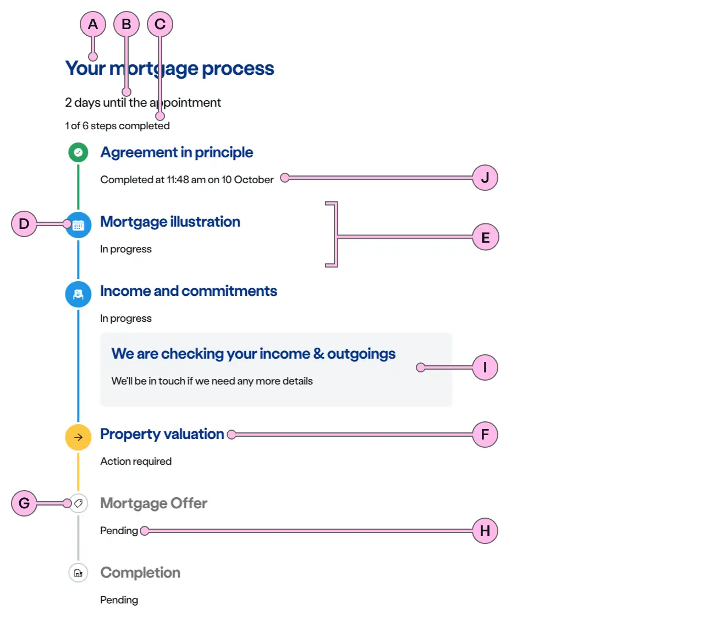
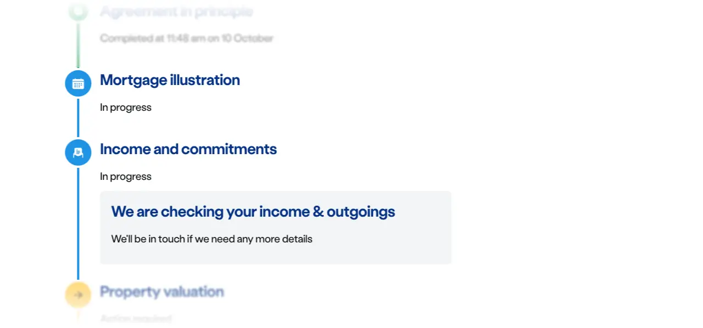
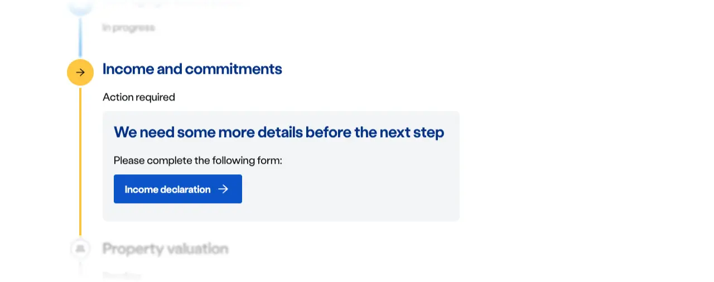

import { StorybookStory } from '../../includes/storybook-story.js'
import { ComponentPlacement } from '../../includes/component-placement.js'
import { PageFooter } from '../../includes/page-footer.js'

## Introduction

> The Timeline component represents a sequence of events that happen within a process.

This component gives an overview of the whole process and progress of a customer journey. Its main purpose is to create situational awareness for the user and manage expectations.

## Content guidance

### Standard variant

Shows steps of a process that has started, showing the status of each step.

| Key | Field type | Guidelines |
| :--- | :--- | :--- |
| A | Heading | Describes the process the whole timeline is showing. It can be left blank if, for example, there is a ns-landmark immediately preceding which describes it. |
| B | Summary | Optional. You can use a short sentence here to help manage expectations. |
| C | Step Count | Display information on the number of events in a process (up to a maximum of 10) and how many have been completed so far. |
| D | Decoration | Choose between default dots, icons or numbers. |
| E | Event | An individual step in the timeline. |
| F | Event Heading | Concise and clear heading description. Keep as short as possible. |
| G | Event Icon | The icon decoration for that particular event. This can change depending on status. (See [Status](#status) below.) |
| H | Event Status | Status is also shown by colour and form of the interconnecting lines and circles in the timeline. Eg. In Progress is 'information blue' and has larger roundels and icons that are solid. Whereas Pending uses a grey outline and is smaller. (See [Status](#status) below.) |
| I | Additional Content | Add further information relevant to this step to aid customer understanding, or if an action is required. |
| J | Event Completed Timestamp | Events that have been successfully completed, there is the option to display a time-stamp alongside the status. |

### Step variant

Sets the expectation of a process that hasn't started or doesn't have any specific status.

| Key | Field type | Guidelines |
| :--- | :--- | :--- |
| A | Heading | Describes the process the whole timeline is showing. It can be left blank if, for example, there is a ns-landmark immediately preceding which describes it. |
| B | Decoration | Number or Fallback. Number is default, the fallback is a dot if no index is specified. |
| C | Event | An individual step in the timeline. |
| D | Event Heading | Concise and clear heading description. Keep as short as possible. |
| E | Additional Content | Add further information relevant to this step to aid customer understanding. |

## Usage - standard variant

<StorybookStory story="components-ns-timeline--standard"></StorybookStory>

### Component placement

<ComponentPlacement component="ns-timeline" parentComponents="ns-panel"></ComponentPlacement>

<ComponentPlacement component="ns-timeline-event" parentComponents="ns-timeline"></ComponentPlacement>

### Features

Have more than one item simultaneously in progress.

Highlight an action that may be required of the user.

Manage expectations by showing warnings that might delay the process.

See the progress being made over a few days.

Let the user know if something goes wrong.

### Status

Each event has a status. The status of the event is controlled by the decoration used.

| Style | Status | Description |
| :--- | :--- | :--- |
| | `pending` |Communicates that the event has yet to commence. |
|  | `inprogress` | Indicates that progress is currently being made on this step. |
|  | `completed` | The event has been successfully completed. |
|  | `actionrequired` | This is used when a customer needs to take action in order to proceed with the process. |
|  | `warning` | Informs of a problem with low severity such as foreseeable delays or outages etc. The problem is expected to be automatically resolved as the situation changes. |
|  | `error` | This is a failure indication. Something couldn't be resolved and so has halted the whole process marking other `inprogress`\ `pending` event(s) `cancelled`. It should be accompanied by a helpful message. |

### Icons & numerals

There are 3 styles of timeline to choose from in the 'overview decorations' - default, icon, or number.

#### Default

Uses a circle and implies nothing other than it is an event.

#### Icons

These can be selected from a list to help convey meaning for each event and make it easier to identify a step. If selected, all events will need an icon chosen from the list.

#### Numbers

For use when an order should be shown.

Some icons are special and automatically reserved for use only with a particular status, such as Complete tick, Action required arrow, Warning triangle, and Error diamond. These show on all the variants of 'overview decoration'.

### Heading, summary and step count

There is provision for a heading to describe what process the timeline is showing. This can be left blank if it has already been made clear in an ns-landmark above it to avoid duplication.

You can also add a summary to manage expectations
>eg. 2 days until your appointment

In addition to this, you can also display information on the number of events using step count. You can have up to 10 steps in a process and show how many have been completed so far. 
>eg. 1 of 6 steps completed

### Showing additional information

On events that are in progress, it is possible to add further information relevant to this step to aid customer understanding, or if an action is required, provide a link to another area such as a form to complete. Warnings and Error status should have helpful messaging added this way, and with links if useful.

On events that have been successfully completed, there is the option to display a time-stamp alongside the status.

## Usage - step variant

<StorybookStory story="components-ns-timeline--step"></StorybookStory>

The step variant is a simpler version of the timeline component that excludes summary and status.

### Icons & numerals

There are 2 styles of timeline to choose from in the 'overview decorations' - number or fallback. The default decoration is to use numbers.

#### Numbers

For use when an order should be shown.

#### Fallback 
Uses a circle and implies nothing other than it is an event.

### Heading

There is provision for a heading to describe what process the timeline is showing. This can be left blank if it has already been made clear in an ns-landmark above it to avoid duplication.

### Showing additional information

In the step variant, additional information can always be added to an event if more explanation is needed. 

## Best practice for the component

| 💚 Do's | 💔 Don'ts |
| :--- | :--- |
| Use a maximum of 10 steps | Add too much detailed content |
| Consider if the title duplicates page title | Use illustrations or icons in additional content |
| Provide helpful messaging | Use overly long event names |
| Use summary to set expectations for the `standard` variant | Use timestamp if it causes confusion with a date elsewhere on the page for the `standard` variant |

## Best practice for each event

| 💚 Do's | 💔 Don'ts |
| :--- | :--- |
| Use text or `ns-card` within `additional content` to provide additional information | Add status to an event for the `step` variant |
| Use either default, icon or number decoration for all events in the timeline sequence for the `standard` variant |  Mix two different decoration types in events |
| Use either number or fallback decoration for all events in the timeline sequence for the `Step` variant | Use any icon type with names ending `solid` or `outline` |

## Specification for the component

| Attribute | Type | Default | Options | Description |
| :--- | :--- | :--- | :--- | :--- |
| `type` | `string` | `standard` | `standard`, `step` | Set to standard to use the more dynamic version of the timeline |
| `showstepcount` | `boolean` | `false` | `true`, `false` | Set true to show completed vs total event progress count below the timeline heading |

| Slots | Type |
| :--- | :--- |
| `heading` | `<h2>` |
| `summary` | `
` |
| `event` | `<ns-timeline-event>` |

## Specification for each event

| Attribute | Type | Default | Options | Description |
| :--- | :--- | :--- | :--- | :--- |
| `status` | `string` | `pending`| `pending`, `inprogress`, `actionrequired`, `warning`, `error`, `completed`, `cancelled` | |
| `icon`| `string` | | `appliance`, `bill`, `boiler`, `calendar`, `clock`, `download`, `electricity`, `energy`, `gas`, `home`, `meter`, `protect`, `rewards`, `search`, `tag`. Please see the [documentation for ns-icon](../components/ns-icon)  | Optional icon to add to the event decoration |
| `index` | `number` | |  | Optional numbered index to add to the event decoration |
| `updatedAt` | `date` | |  | Optional ISO date only used along with `completed` status to record the event completed date & time. |

| Slots | Type |
| :--- | :--- |
| `heading` | `<h3>` |
| `anonymous` | `<ns-card>` |

## Feedback

* Do you have insights or concerns to share? You can raise an issue via [Github bugs](https://github.com/ConnectedHomes/nucleus/issues/new?assignees=&labels=Bug&template=a--bug-report.md&title=[bug]%20[ns-form]).
* See all the issues already raised via [Github issues](https://github.com/connectedHomes/nucleus/issues?utf8=%E2%9C%93&q=is%3Aopen+is%3Aissue+label%3ABug+[ns-form]).

<PageFooter></PageFooter>

## Related links

* [ns-card](../components/ns-card)
* [ns-icon](../components/ns-icon)
