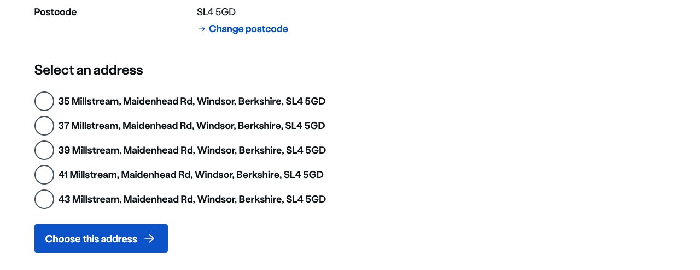

import { ComponentPlacement } from '../../includes/component-placement.js'
import { PageFooter } from '../../includes/page-footer.js'

## Introduction

The address selector is a multi-functional experience pattern that can be used for any one of, or a combination of, the following tasks:

* searching for a specific address by postcode
* adding or entering a new address
* amending an existing address
* selecting an address from a list of existing premises (e.g. multi-premise landlords)

## Usage Examples

### Markup

```markup
<nsx-address-selector postcode="AA12 3BB" addresses="arrayOfAddresses" allowmanualaddress></nsx-address-selector>
```
### Anonymous customer

If the address selector hasn’t been provided with any addresses, it will start by asking for the customer to enter their postcode.


You can [see the anonymous state of `<nsx-address-selector>` here](https://www.britishgas.co.uk/nucleus-experiences/demo/index.html?path=/story/nsx-address-selector--anonymous).

When the customer enters a postcode, the component will dispatch a `postcode-selected` event.  At this point the component shows a `loading` state until it is provided with a list of addresses.

### Multiple addresses

When you set the `addresses` property of the component it will change state to display the addresses and ask the customer to select one.



<!--CONTINUE WITH UPDATING IMAGES FROM HERE-->

You can [see the multi address state of `<nsx-address-selector>` here](https://www.britishgas.co.uk/nucleus-experiences/demo/index.html?path=/story/nsx-address-selector--multi-addresses).

### Many addresses

If there are 6 or more addresses then the component will display the addresses in a select drop-down.


You can [see the many address state of `<nsx-address-selector>` here](https://www.britishgas.co.uk/nucleus-experiences/demo/index.html?path=/story/nsx-address-selector--many-addresses).


### Manual address

If the customer chooses to make changes to their address, they can use the **"Amend your address"** CTA, this will then display the manual entry address form. 

When displaying this form the `manualformenabled` property to set to `true`. You can manually enable this property if required. 


You can [see the manual entry state of `<nsx-address-selector>` here](https://www.britishgas.co.uk/nucleus-experiences/demo/index.html?path=/story/nsx-address-selector--manual-addresses).


## Component placement

<ComponentPlacement component="nsx-address-selector" parentComponents="ns-form"></ComponentPlacement>

## Specification

| Attribute | Type | Default | Options | Description |
| :--- | :--- | :--- | :--- | :--- |
| `addresses`   | `array` | `[]` |  | The list of addresses that will be displayed to the user |
| `allowManualAddress` | `boolean` | false | true, false | When set to true the component will allow you to edit an address manually |

### Addresses

Each address in the addresses array should be an object consisting of the following propeties: `addressLine1`, `addressLine2`, `postalTown`, `county`, `postcode`, `label`.  

The `label` is what will be displayed in the address list UI.

#### Markup

`{ addressLine1: '123 Kings Road', addressLine2: 'Little Village', postalTown: 'Townsville', county: 'Surrey', postcode: 'AA12 3BB', label: '123 Kings Road, AA12 3BB'}`

## Events

| Event | Description | Details |
| :--- | :--- | :--- |
| "postcode-selected"   | dispatched when the user selects a postcode to search with. | "postcode" - the value of the postcode entered by the user |
| "address-selected" | dispatched when the user selects an address from the list of addresses. | "address" - the selected address object |
| "manual-address-click" | dispatched when the user clicks the "Enter Manual Address" button. | |

## Feedback

* Do you have insights or concerns to share? You can raise an issue via [Github bugs](https://github.com/ConnectedHomes/nucleus/issues/new?assignees=&labels=Bug&template=a--bug-report.md&title=[bug]%20[nsx-address-selector]).
* See all the issues already raised via [Github issues](https://github.com/connectedHomes/nucleus/issues?utf8=%E2%9C%93&q=is%3Aopen+is%3Aissue+label%3ABug+[nsx-address-selector]).

<PageFooter></PageFooter>
