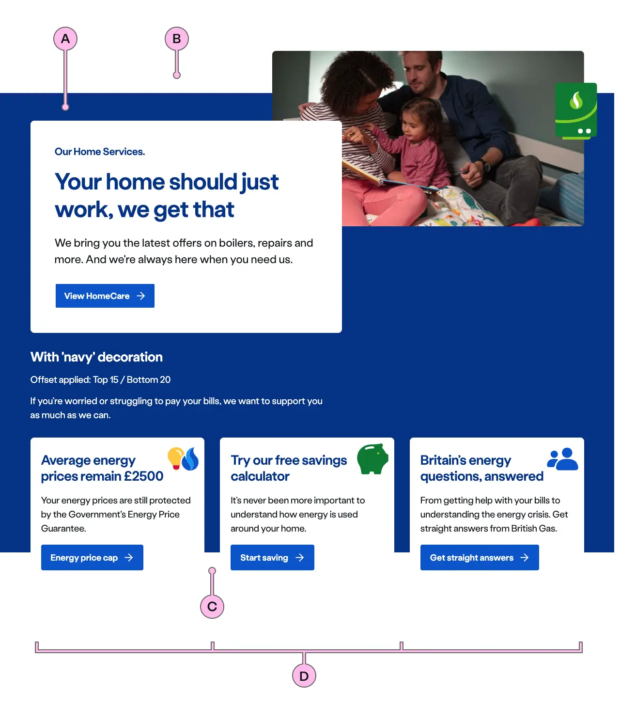

import { StorybookStory } from '../../includes/storybook-story.js'
import { PageFooter } from '../../includes/page-footer.js'

## Introduction

> The `ns-panel` component is an empty container for each section on a page.

It provides an area to place a layout, add an optional decoration and apply the appropriate margins. There can be more than one `ns-panel` on a page.

## Content guidance

| Key | Field type | Guidelines |
| :--- | :--- | :--- |
| A | Decoration | Choose between a no-colour background (default) or one of the available brand colours |
| B | Top offset | Adjust the vertical space which can affect where the decoration starts at the top |
| C | Bottom offset | Adjust the vertical space which can affect where the decoration ends at the bottom |
| D | Columns | You can define a multiple column layout within the `ns-panel` |

## Decoration

Adding decoration to an `ns-panel` utilises a coloured background. It provides visual separation from other sections on the page and introduces brand [colour](foundations/colours) and style.

The decoration has configurable top and bottom margins. These are adjusted separately from the content and allow the content to overlap these edges, if required, to achieve a more visually desirable layout.

By default there is no decoration applied...

## Columns and content

It is possible to apply a number of columns to a layout within a single `ns-panel` by adding the `ns-column` component within it. Note the 3 cards in the examples above have been added this way. (See [ns-column](ns-column)).

Another way to adjust the layout is to use the `ns-content` component within `ns-panel`. This enables formatting of typography and spacing (see [ns-content](ns-content))

## Best practice

| 💚 Do's | 💔 Don'ts |
| :--- | :--- |
| Use decoration to visually separate content | Add decoration to an `ns-panel` where the previous `ns-panel` has a decoration |
| Use appropriate colour for the purpose of page in decorations | Nest a panel in a panel |
| Include more than one layout option in a `ns-panel` |  |

### Considerations of best practice

* Treat each `ns-panel` as a section of the page.
* Include no more than two `ns-lockups` in one `ns-panel` with a decoration.
* Layout options are either a `div`, `ns-article`, `ns-content`, `ns-column` or `ns-lockup`.

## Usage

<StorybookStory story="components-ns-panel--content"></StorybookStory>

## Component placement

The ns-panel component can be used in the following elements/components:

* first child of `<main>`
* [ns-tabs](./ns-tabs)

## Specification

| Attribute | Type | Default | Options | Description |
| :--- | :--- | :--- | :--- |-------------|
| `decoration` | `string` | (no decoration) | `cyan`, `lime`, `navy`, `blue`, `forest`, `slate`, `orange`, `red`, `yellow`, `white`, `grey-light` | Decoration for the background, including the colour. |

| Slots | Type |
| :--- | :--- |
| `anonymous` | `div`, `ns-article`, `ns-content`, `ns-column`, `ns-lockup` |

## Specification notes

* `ns-panel` is **always** a child of the `<main>` element.

### Anonymous

* The `ns-panel` can only have the following children `div`, `ns-article`, `ns-content`, `ns-column` or `ns-lockup`, and `ns-form`.

## Feedback

* Do you have insights or concerns to share? You can raise an issue via [Github bugs](https://github.com/ConnectedHomes/nucleus/issues/new?assignees=&labels=Bug&template=a--bug-report.md&title=[bug]%20[ns-panel]).
* See all the issues already raised via [Github issues](https://github.com/connectedHomes/nucleus/issues?utf8=%E2%9C%93&q=is%3Aopen+is%3Aissue+label%3ABug+[ns-panel]).

<PageFooter></PageFooter>
